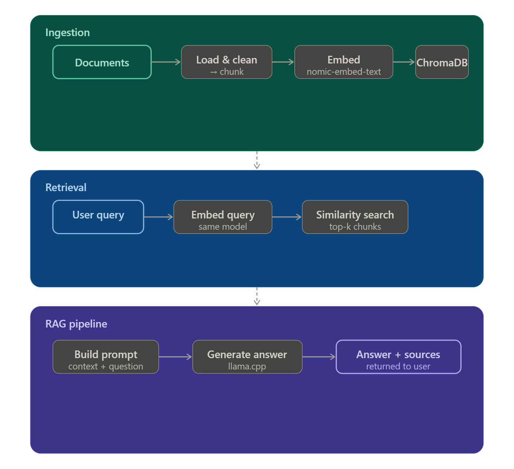

# Architecture

DocSage is organized into three core components built around a shared vector store:

- **Ingestion pipeline** - scans a folder, processes supported documents, generates embeddings, and stores them in ChromaDB  
- **Retrieval layer** - embeds user queries and retrieves the most relevant document chunks using similarity search  
- **RAG pipeline** - combines retrieved context with the user query to build a prompt and generate an answer using the LLM  

These components are exposed through a **Streamlit UI**, which handles user interaction and displays responses with source references.

## High-Level Overview



## Models Used

### Embedding Model - `nomic-embed-text-v1`

The embedding model converts text into a vector (a list of numbers) that captures
its semantic meaning. Its role is **representation** — mapping text into a vector
space where semantically similar content is positioned close together.

`nomic-embed-text-v1` is purpose-built for retrieval tasks, enabling efficient
and accurate similarity search while running entirely locally.

### Generation Model - `mistral-7b-instruct Q4_K_M`

The generation model is responsible for **producing answers** — it takes a prompt
containing the user query and retrieved context, and generates a coherent,
context-aware response.

DocSage uses `mistral-7b-instruct` for its strong instruction-following ability
and efficient local inference.

> On lower-spec machines (e.g. Intel Macs or 8GB RAM systems), a smaller model `Phi-3-mini-4k-instruct-q4.gguf` can be used for improved performance.

Using the same model for both tasks is a common mistake. Embedding and generation
serve different purposes - while LLMs excel at language generation, they are not
optimized to produce the structured vector representations required for
similarity search.

## Vector Store - ChromaDB

ChromaDB is an in-process vector database. It runs inside the same Python process
as the rest of the app — no separate server, no Docker, no infrastructure.

Data is persisted to the `vectorstore/` directory on disk so embeddings survive
between sessions. You only need to ingest a folder once — unless the documents change.

### Deduplication
Every chunk is assigned an MD5 hash of its content as its ChromaDB ID.
Re-ingesting the same folder is safe — ChromaDB's `upsert` operation skips
chunks that already exist.

## Chunking Strategy

Documents are split into fixed-size overlapping chunks:

```
CHUNK_SIZE    = 512 characters   (configurable in .env)
CHUNK_OVERLAP = 64 characters    (configurable in .env)

Document:  [----512----][----512----][----512----]
                    [64][----512----]
                               [64][----512----]
```

The overlap ensures that sentences split across chunk boundaries are still
represented in full in at least one chunk, preserving context.


## Project Structure

```
DocSage/
├── src/
│   ├── config.py       # All settings loaded from .env
│   ├── ingestor.py     # Folder scan → chunk → embed → store
│   ├── retriever.py    # Semantic search against ChromaDB
│   ├── rag_engine.py        # RAG pipeline: retrieve → prompt → generate
│   └── ui/
│       └── app.py      # Streamlit interface
├── models/             # Place your .gguf model here (gitignored)
├── vectorstore/        # ChromaDB persists here (gitignored)
├── tests/              # Tests for each script and the sample docs to ingest
├── .env
├── requirements.txt
└── README.md
```